# IBM Cloud Function deployment for Image Checksum Validation 

This document describes the steps required for deploying  Image Checksum IBM Cloud Function in the NFV account.   

#### Creating Cloud Function Namespace

1. Login to the IBM cloud nfv account
2. Goto **Functions**

> 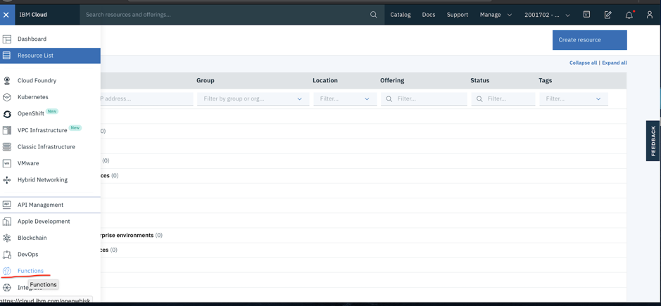

3. Click **Create Namespace** 

> 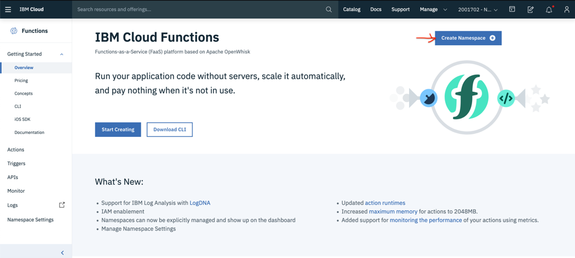

4. Update the fields as shown in the image below
* Name : vnf-vpc-image-scan-namespace
* Description : Image Scan namespace

> 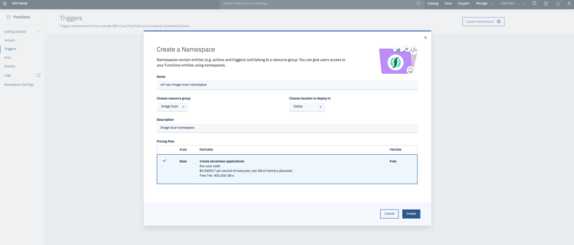

#### Grant cloud function service  to access Cloud Storge Objet (COS)

1. Goto IAM amd Click **Authorizations**
2. Click **Create** 
> 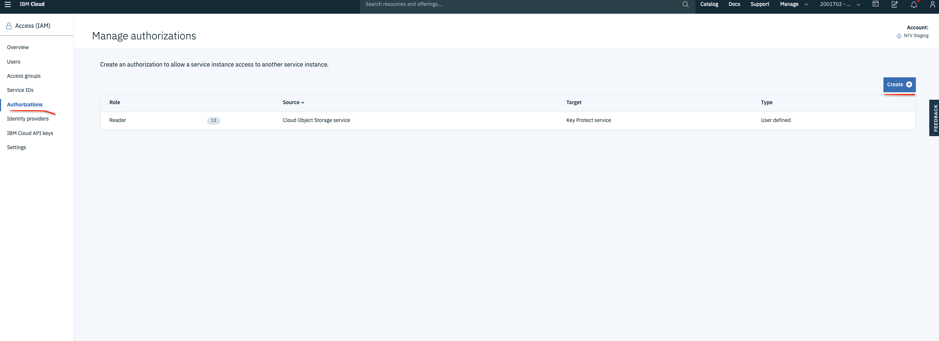
3. Add the details as shown in the image below
> 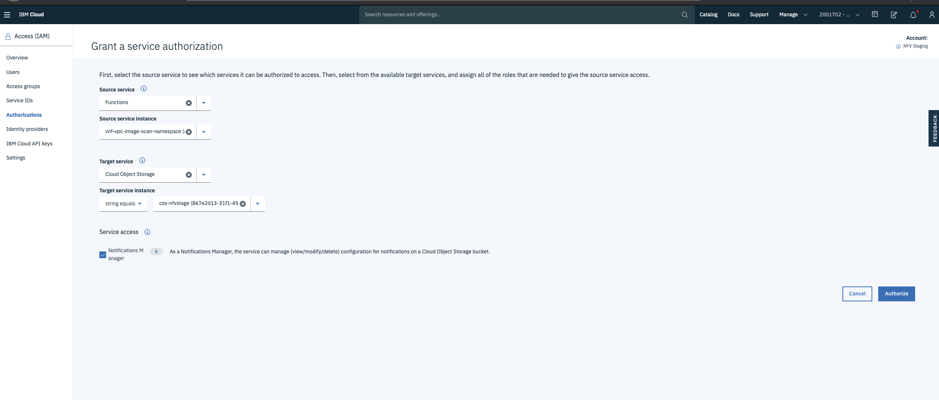

#### Create Cloud Function service API key
1. Click **IBM Cloud API keys**
> 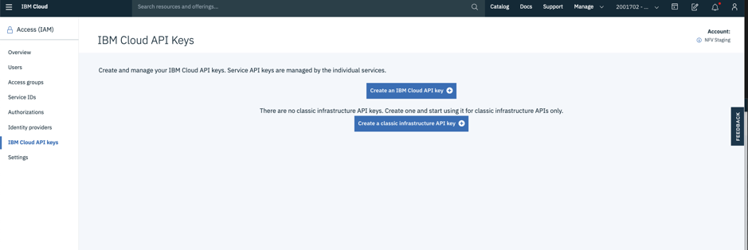
2. Copy and save the key create in step-1 to be used later in the deployment
> 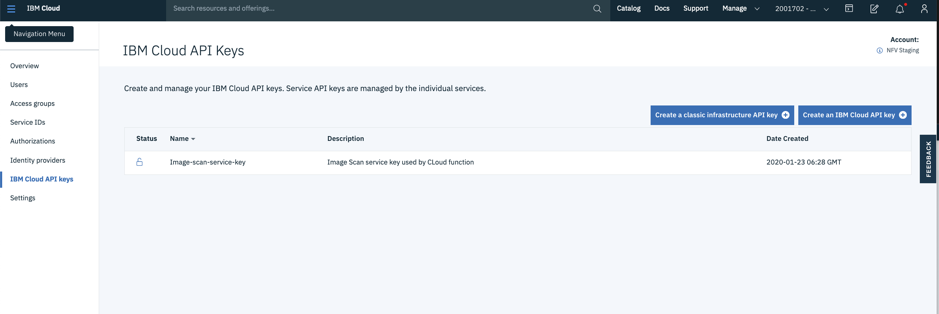

#### Creating Trigger

1. Click **Create**

> 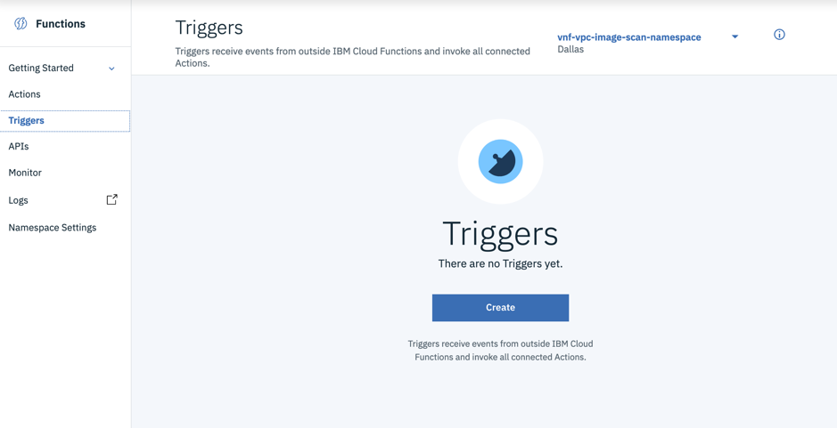

2. Select **Cloud Object Storage**

> 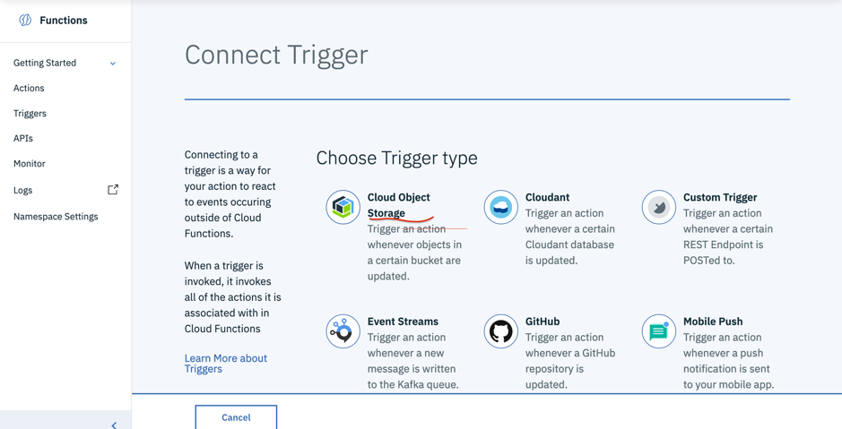

3. Add fields details as shown in the image below

* Trigger Name : vnf-vpc-image-trigger

> 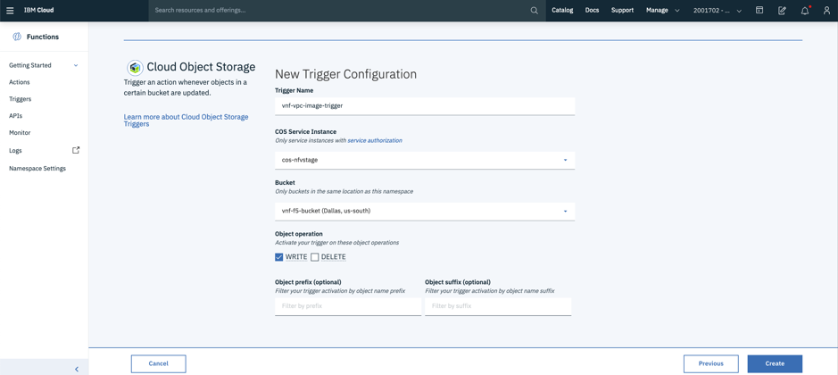

4. Add parameter to the **vnf-vpc-image-trigger** trigger

* endpoint = "s3.us-south.cloud-object-storage.appdomain.cloud"
* serviceAPIKey = "abcdefg" ---> Use the service api key created under ***Create Cloud Function service API key ***

> 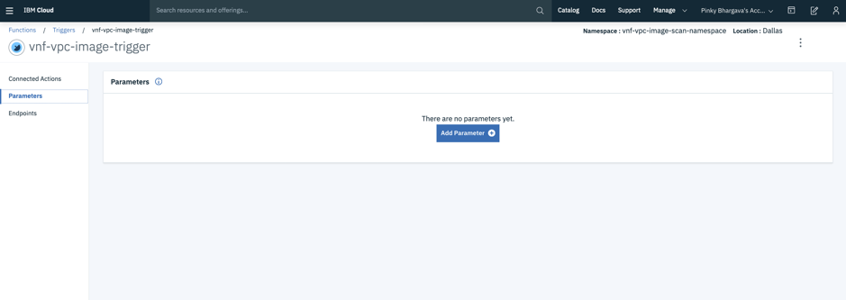

> 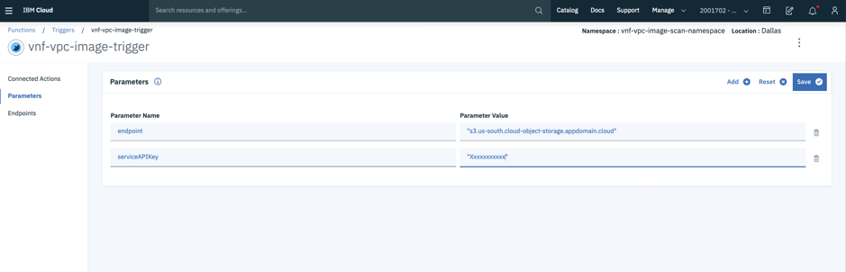

> 

#### Creating Action vnf-vpc-image-checksum
1. git clone git@github.ibm.com:orion/vnf-vpc-imagescan.git
2. cd vnf-vpc-imagescan/actions
3. copy the content of **image-checksum-main.go** file
4. 
>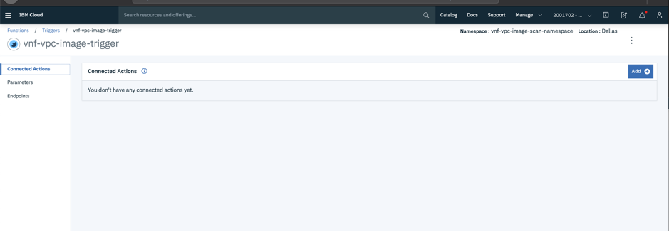

>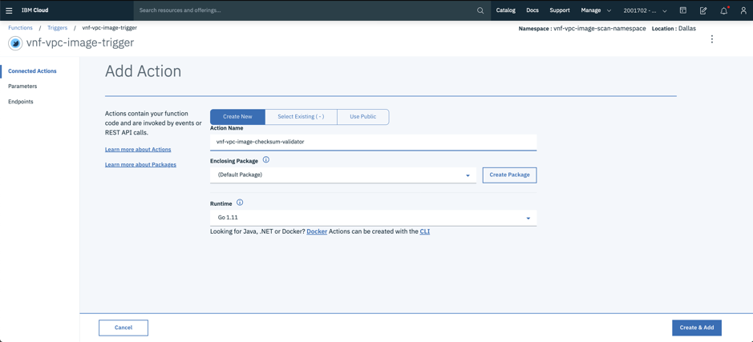

>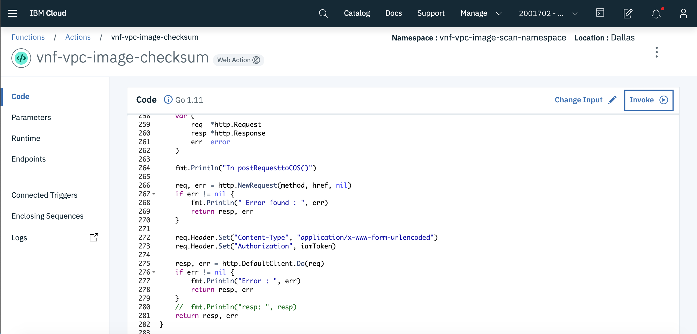

