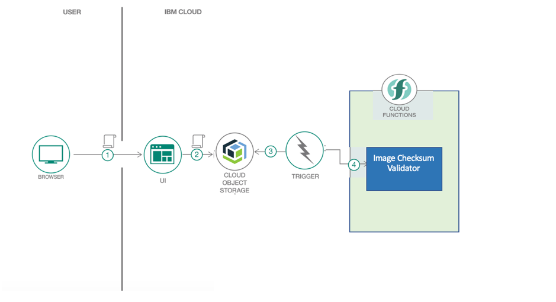
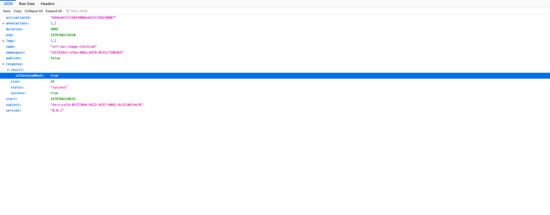

# Checksum Validation for vendor images uploaded by Vendor

This document describes the steps required for performing Checksum Validation for images uploaded by user in Cloud Object Storage.   

1. Image Checksum Architecture

> 

2.  [Click here](Image_Checksum_Cloud_Function_Deployment.md) for details on how to do deployment of Image checksum cloud function .

3. As soon as an image is uploaded in IBM Cloud Object Storage, it triggers Image Checksum validation serverless function to run. This function perform checksum validation for the uploaded image (qcow2) and its respective md5 file , the result is stored in **vnf-vpc-image-checksum** Action Log 

#### Viewing Checksum Validation Result
1. Click on **vnf-vpc-image-checksum** Activity log under Monitor 

> 
2. Verify the Image checksum validation result 

> 

